<p align="center">
  
</p>

<p align="center">
  <strong>AI DevOps chatbot and automated release-loop test agent for Compass Ultra.</strong><br />
  Chat about release readiness, or run Playwright checks against the live demo — external operator evidence for launch gates.
</p>

<p align="center">
  <a href="https://dacameragirl.github.io/Compass-Ultra-AI-Dev-Ops/"></a>
  <a href="https://www.compassultra.com/app?demo=true"></a>
  <a href="https://github.com/DaCameraGirl/Compass-Ultra-Pro"></a>
</p>

<p align="center">
  
  
  
  
</p>

### Languages

<p align="center">
  
  
  
</p>

### Stack

<p align="center">
  
  
  
</p>

<p align="center">
  Built by <strong>Angela Hudson</strong> · <a href="https://github.com/DaCameraGirl">DaCameraGirl</a>
</p>

<p align="center"></p>
<p align="center"></p>

This repo has **two jobs** for **[Compass Ultra](https://www.compassultra.com)** only:

1. **AI DevOps chatbot** — release-readiness Q&A at a public GitHub Pages URL (no install required).
2. **Playwright release-loop test** — automated checks against the live demo app (runs in GitHub Actions daily).

**Demo target:** [https://www.compassultra.com/app?demo=true](https://www.compassultra.com/app?demo=true)

> Not related to Project Hydra or warehouse video tools — those live in separate repos.

```mermaid
%%{init: {'theme': 'dark'}}%%
flowchart LR
  A[Chat or CI trigger] --> B[AI DevOps assistant]
  B --> C[Compass Ultra demo]
  C --> D[Flags + policy gates]
  D --> E[Risk + snapshot diff]
  E --> F[PDF + report artifacts]

  style A fill:#12102a,stroke:#bc8cff,color:#e6edf3
  style B fill:#12102a,stroke:#bc8cff,color:#e6edf3
  style C fill:#0d1b33,stroke:#58a6ff,color:#e6edf3
  style D fill:#0d1b33,stroke:#ffb800,color:#e6edf3
  style E fill:#0d1b33,stroke:#33d69f,color:#e6edf3
  style F fill:#0d1b33,stroke:#33d69f,color:#e6edf3
```



<p align="center"></p>
<p align="center"></p>

**Open the chatbot in your browser — no install, no localhost:**

**[https://dacameragirl.github.io/Compass-Ultra-AI-Dev-Ops/](https://dacameragirl.github.io/Compass-Ultra-AI-Dev-Ops/)**

It runs on GitHub Pages with a built-in release assistant. No API key, no `npm start`, no dev server.

The chatbot can help with:

- Release risk analysis
- Policy gates
- Snapshot diffs
- PDF runbooks
- Rollback planning
- GitHub, Jira, and Slack workflow payloads
- CI release gates
- Launch readiness checklists

Every push to `main` redeploys the chatbot via `.github/workflows/deploy-pages.yml`.

<details>
<summary><strong>Optional: local dev server with OpenAI API</strong></summary>

Only needed if you want to wire in an external AI provider while developing:

```bash
npm install
npm start
```

Then open `http://localhost:8787` and set:

```bash
AI_API_KEY=your_key
AI_BASE_URL=https://api.openai.com/v1
AI_MODEL=gpt-4.1-mini
```

`OPENAI_API_KEY` also works if `AI_API_KEY` is not set.

</details>

<p align="center"></p>
<p align="center"></p>


**In GitHub Actions (recommended):** the workflow in `.github/workflows/ai-devops-test.yml` runs daily at **6:00 UTC** and can be triggered manually from the Actions tab. Reports upload as workflow artifacts.

**Locally (optional):**

```bash
npm install
npx playwright install chromium
npm test
```

The test checks:

- Demo workspace loads
- Core release-review buttons are visible
- Feature flags can be toggled
- AI risk analysis can run
- Snapshot diff opens
- PDF runbook export starts
- Policy gates are visible
- GitHub, Jira, and Slack workflow areas are reachable
- Console errors are collected for review

A local run writes:

- `ai-devops-report.html`
- `risk-analysis-failure.png` if a failure occurs
- `downloaded-runbook.pdf` if export succeeds

<p align="center"></p>
<p align="center"></p>


```text
.
├── .github/workflows/
│   ├── deploy-pages.yml    Publishes chatbot to GitHub Pages
│   └── ai-devops-test.yml  Daily Playwright release-loop test
├── public/                 GitHub Pages site (live URL)
│   ├── app.js
│   ├── index.html
│   └── styles.css
├── tests/test-release-loop.js
├── package.json
├── server.js               Optional local dev server + API proxy
└── README.md
```

<p align="center"></p>
<p align="center"></p>


| Repo | Role |
| --- | --- |
| [Compass-Ultra-Pro](https://github.com/DaCameraGirl/Compass-Ultra-Pro) | Production Compass Ultra app |
| [Compass-Ultra](https://github.com/DaCameraGirl/Compass-Ultra) | Public showcase / docs |
| [compass-ultra-backend](https://github.com/DaCameraGirl/compass-ultra-backend) | API + live AI for the product |

<p align="center"></p>
<p align="center"></p>


This repo is intentionally separate from the main Compass Ultra product repo. It acts like an external AI DevOps operator: chat with it, run release checks, and use the output as launch-readiness evidence.

<p align="center">
  <a href="https://www.compassultra.com/app?demo=true"></a>
  <a href="https://dacameragirl.github.io/Compass-Ultra-AI-Dev-Ops/"></a>
</p>